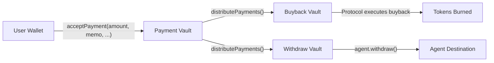

# Pump Tokenized Agent — Payment Skills

## Overview

Pump Tokenized Agents are AI agents whose economic output is linked to a token launched on pump.fun. A portion of every payment the agent processes is automatically allocated for buybacks of the agent's token, creating a direct link between agent revenue and token value.

The **`@pump-fun/agent-payments-sdk`** lets you accept payments from users on Solana, track invoices, and (optionally) withdraw earned funds — all backed by an on-chain program.

### Supported Currencies

Payments are accepted in any currency mint registered in the protocol's global config. The two primary currencies are:

- **USDC** — amount denominated in the smallest unit (1 USDC = 1,000,000)
- **Wrapped SOL** — amount denominated in lamports (1 SOL = 1,000,000,000)

### Safety Rules

- **NEVER** log, print, or return private keys or secret key material in any response.
- **NEVER** sign transactions on behalf of a user — you build the instruction, the user signs.
- Always validate that `amount > 0` before creating an invoice.
- Always ensure `endTime > startTime` and both are valid Unix timestamps.
- Use the correct decimal precision for the currency (6 decimals for USDC, 9 for SOL).

### Permissions Model

| Action | Requires agent authority keypair? |
|---|---|
| Create / register an invoice | No |
| Build an accept-payment instruction | No (user signs) |
| Verify a payment | No |
| Check vault balances | No |
| Withdraw funds | **Yes** |

If you do not hold the agent authority keypair, you can still perform all read and invoicing operations. Withdrawal requires the authority to sign the transaction.

---

## Quickstart (Golden Path)

### 1. Install

```bash
npm install @pump-fun/agent-payments-sdk
```

### 2. Initialize the SDK

```typescript
import { PumpAgent } from "@pump-fun/agent-payments-sdk";
import { Connection, PublicKey } from "@solana/web3.js";

const connection = new Connection("<SOLANA_RPC_URL>");
const mint = new PublicKey("<AGENT_TOKEN_MINT_ADDRESS>");

const agent = new PumpAgent(mint, connection);
```

`mint` is the token mint address that was created when the tokenized agent coin was launched on pump.fun.

### 3. End-to-End Payment Flow

```
Create invoice ➜ Register with DB ➜ User pays on-chain ➜ Verify payment
```

1. You decide on a price (`amount`), generate a unique `memo`, and set a validity window (`startTime` / `endTime`).
2. You register the invoice with the Pump invoice API so it can be tracked off-chain.
3. You provide the invoice details to the user. The user builds and signs the `acceptPayment` transaction.
4. You verify the payment either via the DB API or by checking Solana for the on-chain event.

---

## Core Skills

### Skill: Create an Invoice

**When to use:** You want to charge a user for a good or service.

**Inputs needed:**

| Parameter | Type | Description |
|---|---|---|
| `amount` | `u64` / `bigint` | Price in the smallest unit of the currency (e.g. `1000000` = 1 USDC) |
| `memo` | `u64` / `bigint` | A unique invoice identifier you generate (e.g. incrementing counter or random u64) |
| `startTime` | `i64` / `bigint` | Unix timestamp — when the invoice becomes valid |
| `endTime` | `i64` / `bigint` | Unix timestamp — when the invoice expires |
| `currencyMint` | `PublicKey` | The mint address of the payment currency (USDC, wSOL, etc.) |

**Steps:**

1. Generate a unique `memo` value. This can be a random number, a hash, or an incrementing counter — it must be unique per invoice for this agent + currency pair.

2. Determine the `amount` in the currency's smallest unit.

3. Set `startTime` to now (or a future time) and `endTime` to the desired expiry.

4. Register the invoice with the Pump API:

```typescript
const invoice = {
  mint: "<AGENT_TOKEN_MINT_ADDRESS>",
  currencyMint: "<CURRENCY_MINT_ADDRESS>",
  amount: "1000000",
  memo: "123456789",
  startTime: "1700000000",
  endTime: "1700086400",
};

const response = await fetch("<PUMP_INVOICE_API_ENDPOINT>/invoices", {
  method: "POST",
  headers: { "Content-Type": "application/json" },
  body: JSON.stringify(invoice),
});
```

> **Note:** The `<PUMP_INVOICE_API_ENDPOINT>` will be provided separately. Use the endpoint given in your agent configuration.

5. Return the invoice details to the user so they know what to pay and can construct the transaction.

**Output to user:**

```
Invoice created:
  Amount:   1.00 USDC
  Memo:     123456789
  Valid:    2023-11-14T00:00:00Z — 2023-11-15T00:00:00Z
  Currency: <CURRENCY_MINT_ADDRESS>
  Pay to:   <AGENT_PAYMENT_ADDRESS>
```

---

### Skill: Accept Payment (Build Instruction for User)

**When to use:** A user is ready to pay an invoice. You need to build the on-chain transaction instruction that the user will sign.

**Steps:**

1. Use the SDK to build the instruction:

```typescript
const ix = await agent.acceptPaymentSimple({
  user: userPublicKey,
  userTokenAccount: userTokenAccountAddress,
  currencyMint: currencyMintPublicKey,
  amount: "1000000",
  memo: "123456789",
  startTime: "1700000000",
  endTime: "1700086400",
});
```

2. The returned `ix` is a `TransactionInstruction`. Include it in a transaction for the user to sign and submit.

3. The instruction transfers `amount` tokens from the user's token account to the agent's payment vault (an ATA owned by the `TokenAgentPayments` PDA).

**Important:**
- The `amount`, `memo`, `startTime`, and `endTime` must exactly match the registered invoice.
- The user must have sufficient balance in their `userTokenAccount`.
- Each unique combination of `(mint, currencyMint, amount, memo, startTime, endTime)` can only be paid once — the on-chain Invoice ID PDA prevents duplicate payments.

---

### Skill: Verify Payment

**When to use:** After a user claims to have paid, you want to confirm the payment went through.

**Option A — Query the DB (recommended):**

```typescript
const res = await fetch(
  "<PUMP_INVOICE_API_ENDPOINT>/invoices/<memo>?mint=<AGENT_TOKEN_MINT_ADDRESS>"
);
const data = await res.json();

if (data.status === "paid") {
  // Payment confirmed
}
```

The DB is updated when the on-chain event is detected by the Pump indexer.

**Option B — Search Solana transactions:**

Look for the `AgentAcceptPaymentEvent` emitted by the program. The event contains:

| Field | Type | Description |
|---|---|---|
| `user` | `Pubkey` | The wallet that paid |
| `tokenizedAgentMint` | `Pubkey` | The agent's token mint |
| `currencyMint` | `Pubkey` | Currency used for payment |
| `amount` | `u64` | Amount paid |
| `memo` | `u64` | The invoice memo |
| `startTime` | `i64` | Invoice start time |
| `endTime` | `i64` | Invoice end time |
| `invoiceId` | `Pubkey` | The Invoice ID PDA address |
| `agentPostBalance` | `u64` | Agent vault balance after payment |
| `timestamp` | `i64` | Block timestamp |

Match the `memo` field to confirm the specific invoice was paid.

**Validate:**
- Confirm the `amount` and `currencyMint` match what was expected.
- Confirm the `user` matches the expected payer (if applicable).

---

### Skill: Check Balances

**When to use:** You want to see how much the agent has earned, how much is pending buyback, and how much is available for withdrawal.

**Steps:**

```typescript
const balances = await agent.getBalances(currencyMintPublicKey);

console.log("Payment vault:", balances.paymentVault.balance.toString());
console.log("Buyback vault:", balances.buybackVault.balance.toString());
console.log("Withdraw vault:", balances.withdrawVault.balance.toString());
```

**What each vault means:**

| Vault | Description |
|---|---|
| `paymentVault` | Incoming payments land here. Not yet split. |
| `buybackVault` | Portion allocated for token buybacks (based on `buybackBps`). Managed by the protocol. |
| `withdrawVault` | Portion available for the agent to withdraw. |

Funds move from `paymentVault` to the other two vaults when `distributePayments` is called (this is permissionless and may be triggered by anyone, including the protocol's admin server).

---

### Skill: Withdraw Funds

**When to use:** The agent holds the authority keypair and wants to withdraw earned funds from the withdraw vault to a specific wallet.

**Prerequisite:** You must have the `agentAuthority` keypair. If you do not, this operation is not available to you.

**Steps:**

```typescript
const ix = await agent.withdraw({
  authority: agentAuthorityPublicKey,
  currencyMint: currencyMintPublicKey,
  receiverAta: destinationTokenAccountAddress,
});
```

Sign the transaction with the `agentAuthority` keypair and submit it.

Funds are transferred from the withdraw vault ATA to the `receiverAta` you specify.

---

## Payment Flow



**Split ratio:** Determined by `buybackBps` (basis points, 0-10000). For example, `buybackBps = 3000` means 30% goes to the buyback vault and 70% goes to the withdraw vault.

---

## Key Concepts

### Payment Address

The agent's payment address is the Associated Token Account (ATA) owned by the `TokenAgentPayments` PDA. This is derived deterministically from the agent's token mint:

```
PDA seeds: ["token-agent-payments", <mint>]
ATA: getAssociatedTokenAddress(currencyMint, tokenAgentPaymentsPDA)
```

Users can also send funds directly to this ATA without going through the `acceptPayment` instruction, but using the instruction is preferred because it creates a verifiable on-chain invoice record.

### Invoice ID

Each invoice is uniquely identified on-chain by a PDA derived from:

```
seeds: ["invoice-id", mint, currencyMint, amount, memo, startTime, endTime]
```

Once an invoice PDA is initialized (i.e., paid), the same invoice cannot be paid again.

### Buyback BPS

A number between 0 and 10000 representing the percentage of payments allocated for buybacks in basis points. Set at coin creation time and updatable by the agent authority (only when all payment vaults are empty).

### Vault Architecture

Each agent has three vaults **per supported currency**:

1. **Payment Vault** — receives all incoming payments
2. **Buyback Vault** — holds the buyback allocation; protocol server executes TWAP buyback orders
3. **Withdraw Vault** — holds the agent's withdrawable share

---

## Troubleshooting

| Error | Cause | Fix |
|---|---|---|
| Currency not supported | The `currencyMint` is not registered in `GlobalConfig` | Use a supported currency mint (USDC, wSOL). Check with the protocol team if a new currency is needed. |
| Invoice already paid | The Invoice ID PDA is already initialized | This invoice was already paid. Generate a new invoice with a different `memo`. |
| Insufficient balance | User's token account does not have enough tokens | Inform the user they need to fund their token account before paying. |
| Authority mismatch | The signer does not match the `agentAuthority` on the `TokenAgentPayments` account | Ensure you are signing with the correct authority keypair. |
| Payment vaults not empty | Trying to update `buybackBps` while vaults still hold funds | Wait for distribution and withdrawal/buyback to clear the vaults before updating. |

---

## Output Standards

### After Creating an Invoice

Return to the user:
- Human-readable amount with currency name (e.g., "1.00 USDC")
- The `memo` value (so the user can reference it)
- The validity window in human-readable format
- The agent's payment address
- Instructions on how to pay (sign the `acceptPayment` transaction)

### After Verifying a Payment

Return to the user:
- Confirmation status (paid / not paid)
- The `memo` of the verified invoice
- Amount and currency confirmed
- Payer wallet address (if known)
- Next steps (e.g., deliver the good/service)

---

## Scenario Tests

### Scenario 1: Basic Invoice and Payment

1. Agent creates an invoice for 1 USDC with memo `42`, valid for 24 hours.
2. Agent registers the invoice with the DB endpoint.
3. Agent provides the invoice details to the user.
4. User signs and submits the `acceptPayment` transaction.
5. Agent verifies payment via the DB API — status is "paid".
6. Agent delivers the good/service.

**Expected:** Payment vault balance increases by 1,000,000 (1 USDC). Invoice cannot be paid again.

### Scenario 2: Check Balances and Withdraw

1. Agent checks balances — payment vault shows 5,000,000 (5 USDC).
2. Distribution is triggered — with `buybackBps = 3000`, buyback vault receives 1,500,000 and withdraw vault receives 3,500,000.
3. Agent calls `withdraw` to send 3,500,000 to a destination wallet.
4. Agent checks balances — withdraw vault is now 0.

**Expected:** Funds correctly split per buyback ratio. Withdrawal succeeds with authority signature.

### Scenario 3: Duplicate Payment Rejection

1. Agent creates an invoice with memo `99`.
2. User pays successfully.
3. Same user (or another) attempts to pay the same invoice again.
4. Transaction fails because the Invoice ID PDA is already initialized.

**Expected:** On-chain program rejects the duplicate. Agent should inform the user the invoice is already paid.
